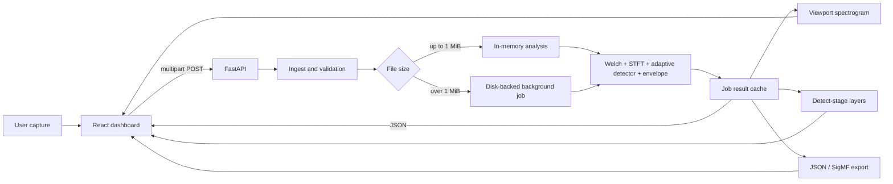

# Architecture

## System boundary

SIH26147 Detect is a local two-process application:

- FastAPI owns file ingestion, validation, DSP, temporary job state, transformed layer generation, and exports.
- React owns user input, request orchestration, progress display, visualization, interaction, and honest unavailable/error states.
- Vite serves the development frontend on port 5173 and proxies `/api` to FastAPI on port 8000.
- No database, message broker, cloud service, login system, or external inference model is involved.

## Architectural units

| Unit | Responsibility | Primary dependency boundary |
|---|---|---|
| `ingest.py` | Turn bytes into a validated `Capture` with explicit interpretation metadata. | NumPy, SciPy WAV I/O, SigMF parser. |
| `sigmf_io.py` | Decode declared sample formats, validate metadata, export annotations. | SigMF library and NumPy. |
| `detect.py` | Analyze one bounded in-memory capture. | NumPy and SciPy signal/ndimage. |
| `large_capture.py` | Read bounded slices, analyze overlapping blocks, pool visualization, merge block detections. | The same bounded detector; it does not duplicate the DSP algorithm. |
| `layers.py` | Produce inspection transformations, waveform previews, and real-audio WAV clips. | Detection band isolation and SciPy filtering/resampling. |
| `api/main.py` | HTTP contract, upload spooling, job lifecycle, concurrency, response shaping. | Pipeline units and FastAPI. |
| `frontend/src/api.ts` | Shared frontend types, HTTP errors, upload progress, and job polling. | Browser Fetch/XHR and session storage. |
| `App.tsx` | Page-level state and composition. | React Query, Motion, UI components, API module. |
| Visualization components | Render measured arrays and selected-candidate detail. | Canvas, Recharts, WaveSurfer. |

## In-memory request flow

1. The browser creates multipart form data containing one capture and optional SigMF metadata.
2. FastAPI streams the upload to a server-created temporary file while enforcing the 2 GiB byte limit.
3. For files at or below 1 MiB, FastAPI reads the temporary copy into bytes.
4. `load_capture` validates metadata and creates a `Capture` whose `iq` member is a bounded `complex64` NumPy array.
5. `analyze_capture` computes Welch PSD, spectrogram, energy mask, frequency bands, envelope measurements, confidence, logs, settings, and PSD points.
6. The API assigns a UUID job ID, stores the `Capture` and `DetectionResult` in the in-process ordered dictionary, and returns the real response with HTTP 200.
7. The temporary upload file is deleted because the job owns the in-memory array.
8. Follow-up visualization/layer/export calls use the job ID.

## Large-file request flow

1. Upload spooling is identical, but a file over 1 MiB is not read into one byte string.
2. The API reserves the single compute slot and inserts a queued job.
3. The response is HTTP 202 with a job ID and status URL.
4. A one-worker thread executor opens a `DiskSamples` reader and validates the header/format.
5. The background worker reads 524,288-sample core blocks with computed guard context.
6. Each bounded block passes through the ordinary `analyze_capture` function.
7. Core STFT frames are maximum-pooled into at most 768 overview rows. Full-resolution detection occurs before display pooling.
8. Adjacent block candidates are merged by frequency overlap, and boundary pulse windows are joined.
9. Progress records exact processed and total sample counts.
10. On completion, the job stores the disk-backed capture and result. The browser obtains it through polling.
11. The retained upload is deleted on failure, expiration, or finished-job eviction.

See [Large-file processing](LARGE_FILE_PROCESSING.md) for the exact constants and limits.

## Runtime state model

`JOBS` is an in-process `OrderedDict`. A job may contain:

| Field | Purpose |
|---|---|
| `status` | `queued`, `processing`, `complete`, or `failed` for asynchronous jobs. Small completed jobs omit it and are treated as complete. |
| `created` | Monotonic timestamp used for finished-job expiration. |
| `path` | Temporary upload path for a successful large job. |
| `processed_samples` / `total_samples` | Truthful full-scan progress. |
| `progress` | Fraction from 0 to 1. |
| `message` | Current user-readable state. |
| `capture` | In-memory or disk-backed `Capture`. |
| `result` | `DetectionResult`, including response data and visualization arrays. |
| `layers` | Cache of at most four selected detections’ layer metadata and WAV bytes. |
| `error` | Failure message when a background job fails. |

The store is protected by an `RLock`. A `BoundedSemaphore(1)` prevents concurrent analysis. A `ThreadPoolExecutor(max_workers=1)` executes long jobs. This design is appropriate for a local single-process demonstration; it is not a durable distributed job system.

## Data ownership

- The browser owns the original user-selected `File` object.
- Starlette may spool multipart content as part of request handling.
- The API writes its own copy under `backend/data/jobs/`.
- Small jobs convert that copy to a NumPy array and delete the copy.
- Large jobs retain the copy until failure, expiration, eviction, or server-side cleanup.
- Generated test truth is stored separately and is never passed into the detector.
- Browser plots and readouts receive data only from API responses.

## Failure behavior

| Failure | Result |
|---|---|
| API unreachable | Frontend displays “Not connected” and withholds computed panels. |
| Missing IQ metadata | HTTP 422 with `input_required`; no guessed interpretation. |
| Ambiguous stereo WAV | HTTP 422 until the user chooses IQ, left audio, or right audio. |
| Malformed/inconsistent data | HTTP 422; no partial analysis is returned. |
| More than 2 GiB | HTTP 413. |
| Compute slot occupied | HTTP 429. |
| Polling unfinished result endpoint | HTTP 409 and instruction to poll job status. |
| Expired/missing job | HTTP 404. |
| Background scan fails | Job becomes `failed`; upload is deleted; no partial result is published. |

## Trust boundaries and deployment posture

The service binds to loopback in the documented command and has no authentication. CORS permits only local Vite origins, but browser CORS is not an access-control system. Do not expose port 8000 to an untrusted network. File parsing and numerical work should be treated as untrusted-input processing. A production system needs authentication, quotas, a durable queue/store, isolation, malware/file-format hardening, monitoring, cancellation, and multi-process-safe state.
